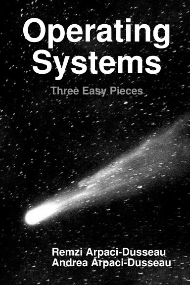

<!-- _class: lead -->

<!-- _header: L3 Miage • 2024-2025 • Systèmes d'exploitation -->

# Organisation du cours

 

EL Mehdi Mouddene
elmehdi.mouddene@gmail.com - (@dauphine.psl.eu à confirmer)

<!-- _footer:  -->

---

## Objectifs

1. Comprendre le **rôle** d'un système d'exploitation et de ses composants.

2. Être capable d'interagir avec un système d'exploitation de type Unix grâce à l'**interpréteur de commandes**.

3. Comprendre le lien entre **développement applicatif** et système d'exploitation.

4. Maîtriser les bases de la **programmation système** sous Unix en C.

5. Comprendre les mécanismes centraux d'un système d'exploitation (**virtualisation**, **concurrence** et **persistence**) et leurs implémentations.

---

## Prérequis

* Une précédente expérience avec un language de programmation (C, C++, Java, etc.);
* une expérience élémentaire avec l'utilisation d'un système d'exploitation (Unix de préférence);
* de la motivation.

---

## Organisation

* 15 heures de CM
* 15 heures de TP

## Évaluation

* Projet informatique (30 % de la note finale).
* Examen terminal (70 % de la note finale).

---

L'ouvrage de référence pour ce cours est [**Operating Systems: Three Easy Pieces** de _Remzi H. Arpaci-Dusseau_ et _Andrea C. Arpaci-Dusseau_](https://pages.cs.wisc.edu/~remzi/OSTEP/).
Je tiens également à remercier [**Thibaud Martrinez**](https://rocketreach.co/thibaud-martinez-email_74232515) pour avoir mis à disposition des ressources pédagogiques que j'ai pu adapter et dont j'ai pu m'inspirer pour créer le cours.

 

:information_source: Il est disponible librement sur [son site Internet](https://pages.cs.wisc.edu/~remzi/OSTEP/).

 

Les autres sources sont directement indiquées sur les supports de présentation.

---

Une maîtrise élémentaire du **langage de programmation C** est nécessaire pour ce cours.

→ On pourra se référer au document [Essential C](http://cslibrary.stanford.edu/101/EssentialC.pdf) mis à disposition par [Stanford CS Education Library](http://cslibrary.stanford.edu).

→ [**Effective C** par _Robert C. Seacord_](https://nostarch.com/Effective_C) constitue un bon ouvrage de référence, pour un traitement plus complet du sujet. 

---

## Plan

1. Introduction
2. Virtualisation (CPU) : les processus
3. Virtualisation (CPU) : ordonnancement
4. Virtualisation (mémoire) : segmentation
5. Virtualisation (mémoire) : pagination
6. Concurrence : threads et verrous
7. Concurrence : condition variables et sémaphores
8. Persistence : systèmes de fichiers
9. Persistence : implémentation des systèmes de fichiers
10. Persistence : journalisation
