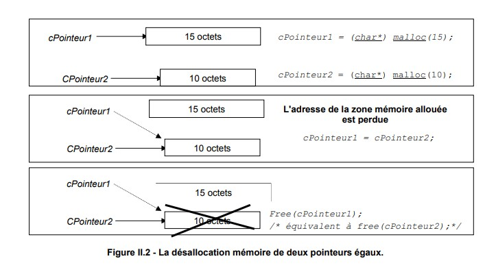

<!-- _class: lead -->

<!-- _header: L3 Informatique • 2024-2025 • Systèmes d'exploitation -->

# Eléments de langage C pour la programmation Système

<br>

EL Mehdi Mouddene
elmehdi.mouddene@dauphine.psl.eu

<!-- _footer:  -->

---

## Introduction

Le langage C est le langage de référence pour la programmation système, notamment sous Unix/Linux.
Il permet un accès bas niveau aux ressources matérielles tout en offrant une syntaxe relativement simple.
Ce chapitre prépare les étudiants à aborder les appels systèmes, la gestion de processus, la mémoire et les threads.

---

## Exemple d'un appel system

```c
#include <unistd.h>
#include <stdio.h>

int main() { // point d'entrée du programme.
    pid_t pid = getpid(); // Appel système pour obtenir l'identifiant du processus
    printf("PID courant : %d\n", pid);
    return 0;
}
```

---

## Types de base et opérateurs
Le C offre des types fondamentaux :

* char, short, int, long : entiers signés

* unsigned char, unsigned int, etc. : entiers non signés

* float, double, long double : nombres à virgule flottante

* _Bool (C99) : booléen (0 ou 1)

* void : absence de type

---

## Types de base et opérateurs - suite

Les opérateurs en C se divisent en plusieurs catégories :

-  Affectation : =, +=, -=, *=, /=, etc.
- Arithmétiques : +, -, *, /, %
- Logiques : &&, ||, !
- Comparaison : ==, !=, <, >, <=, >=
- Bit à bit : &, |, ^, ~, <<, >>
- Incrément/Décrément : ++, --
- Conditionnel : ?:
- Déréférencement et adresse : *, &
- Accès mémoire : [], . et ->

---

## Types de base et opérateurs - Exemple

```c
#include <stdio.h>
#include <stdint.h>

int main() {
    unsigned int flags = 0b1010;     // Utilisation d'entiers non signés
    unsigned int mask = 0b0101;

    printf("AND : %u\n", flags & mask);    // Opération bit à bit
    printf("OR  : %u\n", flags | mask);
    printf("XOR : %u\n", flags ^ mask);
    printf("COMPLEMENT : %u\n", ~flags);

    int a = 5, b = 2;
    float c = (float)a / b;
    printf("Division flottante : %.2f\n", c);

    return 0;
}
```

---

## Pointeurs et gestion de la mémoire

Les pointeurs sont centraux en C, ils permettent de manipuler les adresses mémoire, ce qui est fondamental pour accéder aux buffers, zones mémoire partagées ou structures système.
Il est essentiel de comprendre :

* la déclaration d'un pointer (int *p;)

* l’affectation d'une reference ou une adress à un pointer (p = &x;)

* la déréférenciation (*p)->

L’allocation dynamique se fait via **malloc**, **calloc** et **free**.

Une mauvaise gestion peut provoquer des fuites ou des erreurs critiques **(segmentation fault)**.

---

## Pointeurs et gestion de la mémoire - Exemple 1

```c
int *ptr = malloc(sizeof(int)); // Allocation dynamique d’un entier
*ptr = 42;                      // Affectation via le pointeur
printf("%d\n", *ptr);           // Affichage de la valeur pointée
free(ptr);                      // Libération de la mémoire
```

---

## Pointeurs et gestion de la mémoire - Exemple 2

```c
#include <stdlib.h>
#include <string.h>
#include <stdio.h>

int main() {
    char *buffer = malloc(128);
    if (buffer) {
        strcpy(buffer, "Chaîne allouée dynamiquement\n");
        write(1, buffer, strlen(buffer)); // Écriture directe sur la sortie standard
        free(buffer);
    }
    return 0;
}
```

---

## Pointeurs (Bad Example)



```c
#include <stdio.h>
#include <stdlib.h>
#include <string.h>
/**************************************************************/
/* Programme principal */
/* Exemple de modification d'adresse pointée par un pointeur */
/**************************************************************/
void main ()
{
    /* Déclaration et initialisation de deux pointeurs sur des
    caractères - NULL = pointeur vide */
    char* cPointeur1=NULL;
    char* cPointeur2=NULL;
    /* cPointeur1 pointe sur une zone mémoire de taille 15 oct */
    cPointeur1 = (char*) malloc (15);
    /* cPointeur2 pointe sur une zone mémoire de taille 10 oct */
    cPointeur2 = (char*) malloc(10);
    /* cPointeur1 pointe sur l'adresse de cPointeur2 */
    cPointeur1 = cPointeur2; /* ATTENTION: l'adresse pointée par
    cPointeur1 est perdue. Mais la
    mémoire est toujours allouée. */
    /* Désallocation mémoire de cPointeur1*/
    free(cPointeur1); /* équivalent à free (cPointeur2)*/
}
```


---

## Structures

* Les struct permettent de regrouper plusieurs variables sous un même nom.

```c
struct Point {
    int x;   // Coordonnée x
    int y;   // Coordonnée y
};

struct Point p = {1, 2};
printf("x = %d, y = %d\n", p.x, p.y); // Accès aux membres de la struct p
```

---

## Structures - Exemple d'une struct système 1

Souvent utilisées pour interagir avec les structures des appels systèmes (ex : stat, timeval, etc.).

```c
#include <sys/stat.h>
#include <stdio.h>

int main() {
    struct stat infos;
    if (stat("/etc/passwd", &infos) == 0) {
        printf("Taille fichier: %ld octets\n", infos.st_size);
    }
    return 0;
}
```

---

## Structures - Exemple d'une struct système 2

Souvent utilisées pour interagir avec les structures des appels systèmes (ex : stat, timeval, etc.).

```c
struct proc {
    char *mem;                  // Start of process memory
    uint sz;                    // Size of process memory
    char *kstack;               // Bottom of kernel stack for this process
    enum proc_state state;      // Process state
    int pid;                    // Process ID
    struct proc *parent;        // Parent process
    void *chan;                 // If !zero, sleeping on chan
    int killed;                 // If !zero, has been killed
    struct file *ofile[NOFILE]; // Open files
    struct inode *cwd;          // Current directory
    struct context context;     // Switch here to run process
    struct trapframe *tf;       // Trap frame for the  current interrupt
};
```

## Fonctions

* Une **fonction** est définie par son type de retour, son nom et ses paramètres.

```c
void afficher(int x) {
    printf("%d\n", x); // Affiche la valeur passée en paramètre
}
```

Le passage par reference ou (adress) :

```c
void incrementer(int *p) {
    (*p)++; // Incrémente la valeur pointée
}
```

---

## Fonctions - Exemple d'un appel system

Essentielles pour structurer un programme système, par exemple pour encapsuler des appels systèmes ou abstraire des tâches bas niveau.

```c
#include <unistd.h>
#include <stdio.h>

void afficher_pid() {
    printf("Mon PID est : %d\n", getpid());
}

int main() {
    afficher_pid();
    return 0;
}
```

---

## Gestion des fichiers (niveau C standard)

Le C standard utilise des pointeurs de fichier (FILE *).

```c
FILE *f = fopen("test.txt", "w");      // Ouverture d'un fichier test.txt en écriture
if (f) {
    fprintf(f, "Hello\n");             // Écriture dans le fichier
    fclose(f);                         // Fermeture du fichier
}
```

---

## Gestion des fichiers

Exemple de manipulation d'un fichier en utilisant les appels système Unix.

```c
#include <stdio.h>
#include <fcntl.h>      // pour open()
#include <unistd.h>     // pour read() et close()
#include <string.h>
#include <errno.h>

int main() {
    int fd; // file descriptor
    char buffer[128];
    ssize_t bytes_read;

    fd = open("/etc/hostname", O_RDONLY);  // permet d'accéder à un fichier par son nom. Ouvrir le fichier 
    en lecture seule
    if (fd == -1) {
        perror("Erreur lors de l'ouverture du fichier");
        return 1;
    }

    // Lire jusqu'à 127 octets (on laisse 1 octet pour le � final)
    bytes_read = read(fd, buffer, sizeof(buffer) - 1);  // lit un certain nombre d'octets dans un buffer.
    if (bytes_read == -1) {
        perror("Erreur lors de la lecture du fichier");  //  pour afficher les erreurs systèmes
        close(fd);
        return 1;
    }

    buffer[bytes_read] = '�'; // Ajouter le caractère de fin de chaîne
    printf("Contenu lu : %s", buffer);

    // Fermer le fichier
    if (close(fd) == -1) {  // Toujours terminer par close() pour libérer la ressource.
        perror("Erreur lors de la fermeture du fichier");
        return 1;
    }

    return 0;
}


```

---

## Compilation et makefiles

Compilation simple :

```shell
gcc main.c -o programme    # Compilation du fichier source en exécutable
```

Makefile minimal :

```shell
all:
    gcc main.c -o programme  # Règle par défaut pour compiler

# ou 

programme: main.o
    gcc -Wall -o programme main.o

main.o: main.c
    gcc -Wall -c main.c
```

---

## Introduction aux threads (bibliothèque POSIX pthread)

Création de threads pour paralléliser des tâches, exécuter en simultané plusieurs sections critiques.

```c
int pthread_create(pthread_t *restrict thread,
                          const pthread_attr_t *restrict attr,
                          void *(*start_routine)(void *),
                          void *restrict arg);
```

* pthread_t *thread: pointeur vers l'identifiant du thread créé

* pthread_attr_t *attr: attributs du thread (NULL pour les valeurs par défaut)

* void *(*start_routine)(void *): fonction exécutée par le thread

* void *arg: argument transmis à la fonction du thread (pointeur générique)

---

## Introduction aux threads

Création de threads pour paralléliser des tâches, exécuter en simultané plusieurs sections critiques.

```c
#include <pthread.h>
#include <stdio.h>

void *tache(void *arg) {
    printf("Thread actif\n");  // Code exécuté par le thread
    return NULL;
}

int main() {
    pthread_t t1;
    pthread_create(&t1, NULL, tache, NULL); // Création du thread
    pthread_join(t1, NULL);                 // Attente de fin du thread
    return 0;
}
```

---

## Concurrence et synchronisation

Utilisation d’un mutex (mutual exclusion) utile pour éviter les accès concurrents en mémoire partagée, synchroniser l’accès à des ressources critiques.

```c
#include <pthread.h>
#include <stdio.h>

pthread_mutex_t mutex = PTHREAD_MUTEX_INITIALIZER;

void *routine(void *arg) {
    pthread_mutex_lock(&mutex);     // Début section critique
    printf("Section critique\n");   // <-- Code critique içi
    pthread_mutex_unlock(&mutex);   // Fin section critique
    return NULL;
}

int main() {
    pthread_t t1, t2;
    pthread_create(&t1, NULL, routine, NULL); // créer un premier thread t1 
    pthread_create(&t2, NULL, routine, NULL); // créer un premier thread t2 
    pthread_join(t1, NULL);
    pthread_join(t2, NULL);
    return 0;
}


```

---

## Bonnes pratiques

* Toujours vérifier les retours de fonctions

* Libérer la mémoire allouée

* Utiliser des noms clairs et des commentaires

* Modulariser le code avec des fichiers .h et .c

* Éviter les variables globales

---

### Pour aller plus loin (Recommandé)

> Pour approfondir vos connaissances sur le langage C, notamment ses bases et subtilités, je vous recommande vivement de consulter le cours du Pr. **M. Manouvrier** :

👉 [Cours de C par Mme Manouvrier](https://www.lamsade.dauphine.fr/~manouvri/C/Polys_C_MM.pdf)

Ce support est très complet et complémentaire à notre intro au langage C.
