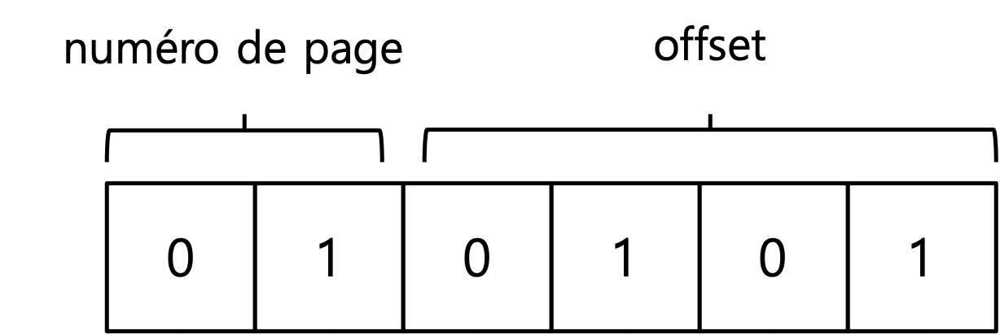
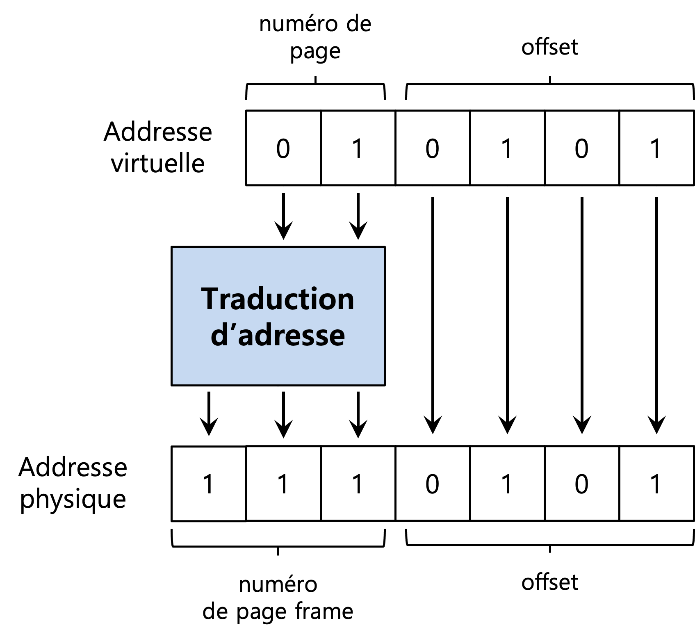
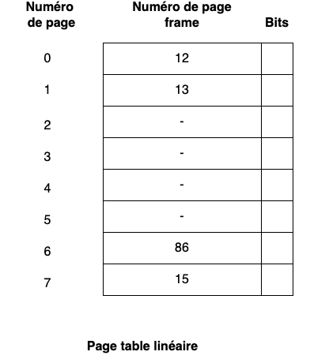
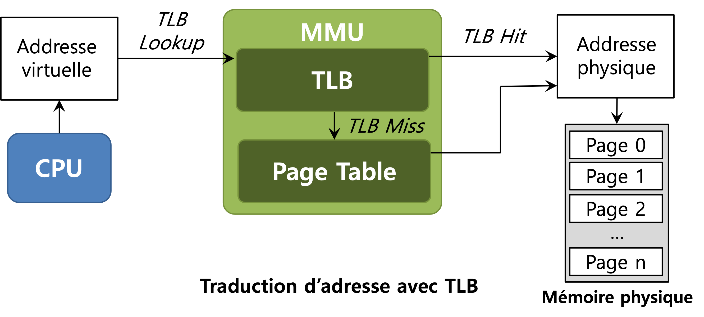
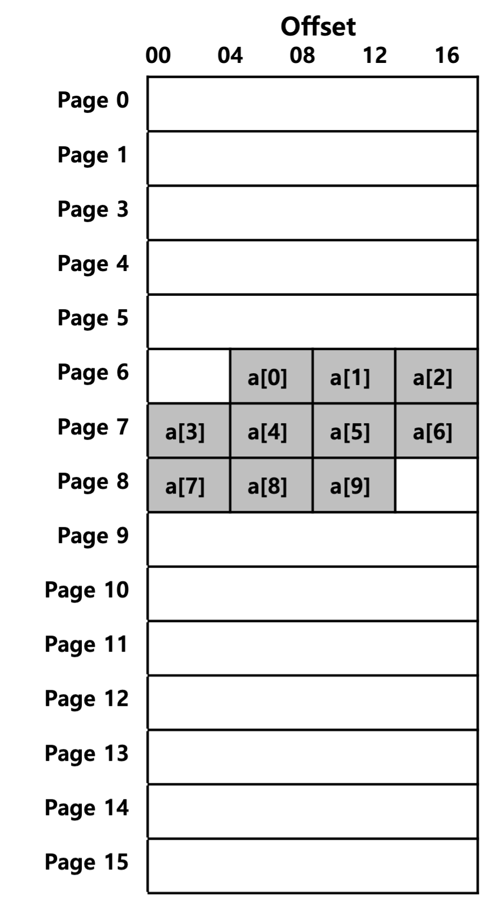
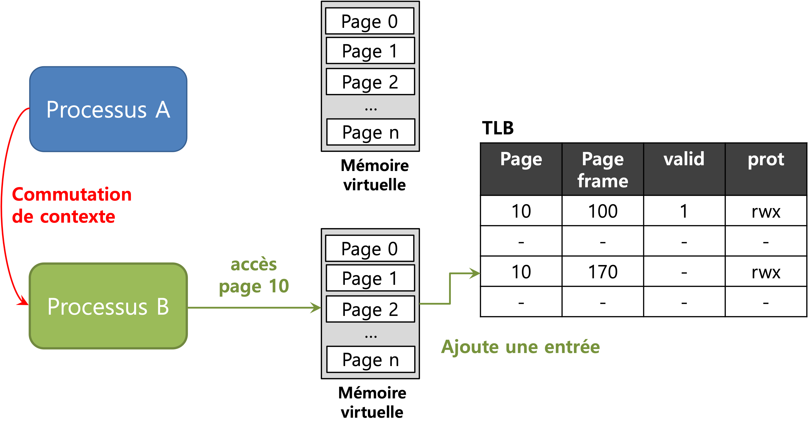
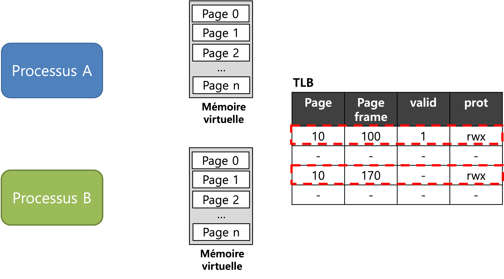
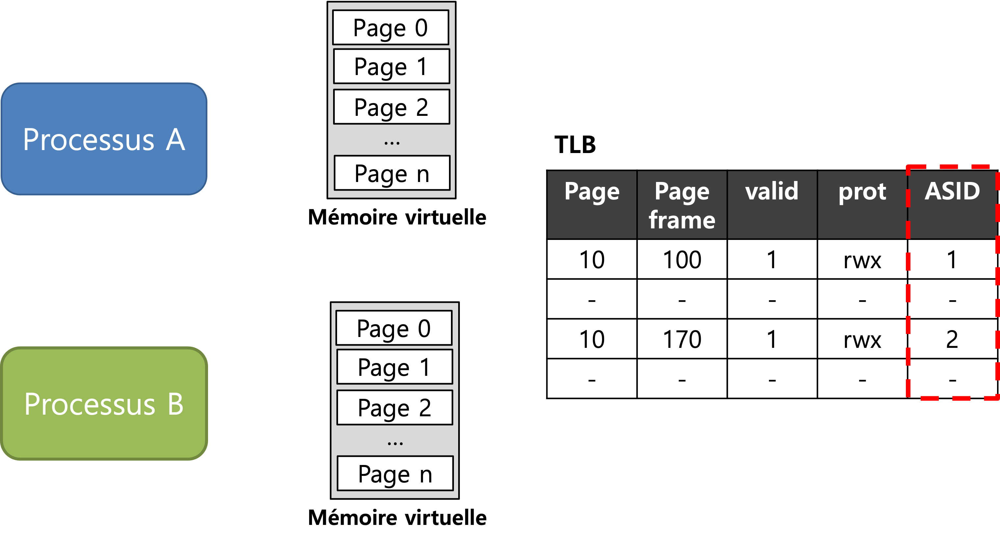
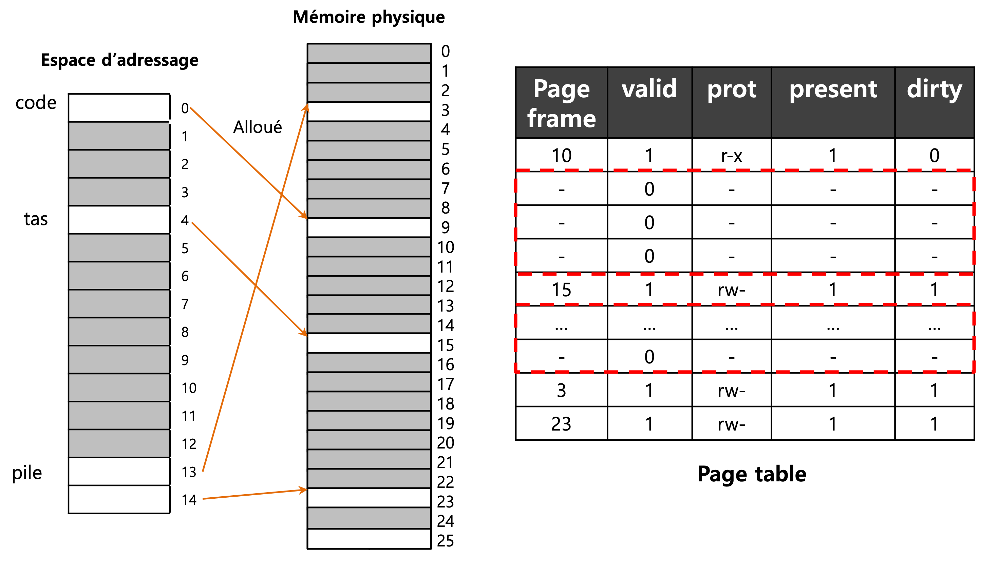
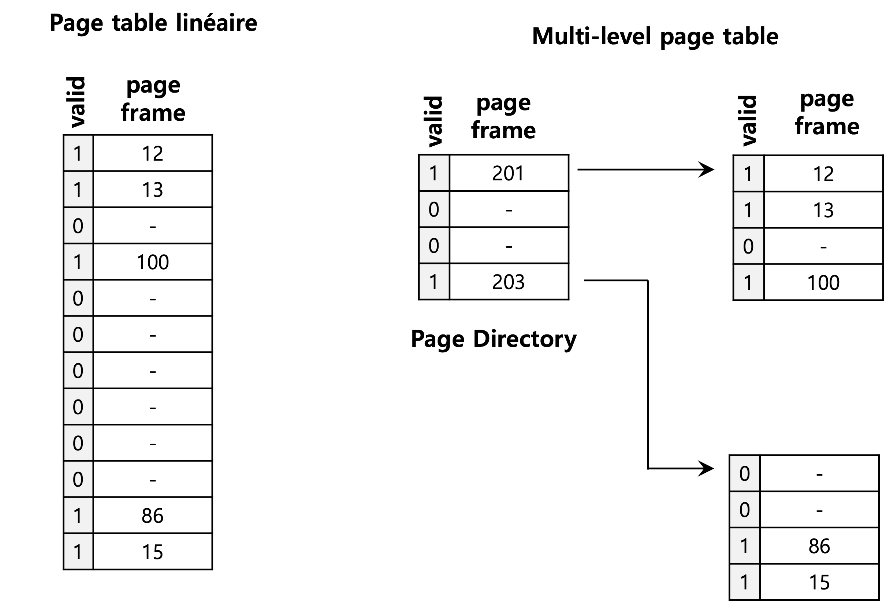

<!-- _class: lead -->

<!-- _header: L3 Informatique • 2024-2025 • Systèmes d'exploitation -->

# Virtualisation (mémoire) : pagination

<br>

EL Mehdi MOUDDENE
el-medhi.mouddene@dauphine.psl.eu

<!-- _footer:  -->

---

Cette présentation couvre les chapitres [18](https://pages.cs.wisc.edu/~remzi/OSTEP/vm-paging.pdf), [19](https://pages.cs.wisc.edu/~remzi/OSTEP/vm-tlbs.pdf) et [20](https://pages.cs.wisc.edu/~remzi/OSTEP/vm-smalltables.pdf) de Operating Systems: Three Easy Pieces.

<br>

Les diapositives sont librement adaptées de diapositives de _Youjip Won (Hanyang University)_.

---

## Pagination (_paging_)

La pagination divise l'**espace d'adressage** en unités de taille fixe appelées **page**.

&nbsp;&nbsp;&nbsp;&nbsp; ≠ segmentation : taille variable des segments logiques (code, pile, tas, etc.)

<br>

La mémoire physique est également divisée en un certain nombre d'unités appelées **page frames**.

---

## Avantages de la pagination

**Flexibilité** : prise en charge de l'abstraction de l'espace d'adressage indépendamment de la manière dont un processus utilise l'espace d'adressage.

<br>

**Simplicité** : il est facile de gérer la mémoire (notamment avec une _free list_) car la page dans l'espace d'adressage et la **page frame** sont de la même taille.

→ Pas de problème de **fragmentation** comme avec la segmentation.

---

## Page table

* Structure de données pour traduire une adresse virtuelle en adresse physique.

* Fait correspondre chaque **page** (virtuelle) avec son **page frame** (physique).

* Il est nécessaire d'avoir **une page table par processus**.


<center>

| Page (virtuelle) | Page frame (physique) |
|------------------|-----------------------|
| 0                | 3                     |
| 1                | 7                     |
| 2                | 5                     |

_Exemple simplifié de page table_

</center>

---

## Exemple : pagination

* Mémoire physique de 128 octets avec cadres de page de 16 octets.
* Espace d'adressage de 64 octets avec des pages de 16 octets.


---

## Traduction d'adresse

Deux parties de l'adresse virtuelle :
* numéro de page (virtuelle)
* offset : position au sein de la page


Exemple : adresse virtuelle 21 dans un espace d'adressage de 64 octets



---

## Exemple : traduction d'adresse

L'adresse virtuelle 21 dans un espace d'adressage de 64 octets.



---

## Stockage des page tables

Les page tables peuvent être très **volumineuses**.

* Par exemple:
    * Adresses mémoires sur 32 bits (20 bits pour le numéro de page), pages de 4 KB, entrée de 4B dans la table.
    
    * 2<sup>20</sup> * 4B = **4MB par page table**.

Les page tables des processus sont **stockées en mémoire vive** et non pas dans la memory management unit (MMU).

---

## Que contient la page table ?

* Structure de données utilisée pour faire correspondre l'adresse virtuelle à l'adresse physique.

<div class=columns>
<div>

* Forme la plus simple : une **page table linéaire**, un _array_.


    Le système d'exploitation indexe le tableau par numéro de page et recherche l'entrée de la page table correspondante.

</div>
<div>



</div>
</div>

---

## Entrée dans la page table 

* Numéro de la page frame.

* **Bits indicateurs** :

    * **_Valid bit_** : indique si la traduction en question est valide.

    * **_Protection bit_** : indique si la page peut être lue, écrite ou exécutée.

    * D'autres bits : _present bit_, _dirty bit_, _reference bit_...


---

## Accéder à une adresse mémoire : performance

Pour chaque référence mémoire, la pagination oblige le système d'exploitation à effectuer une référence mémoire supplémentaire.

### Etapes

1. Extraire le numéro de page de l'adresse virtuelle.

2. Récupérer l'entrée correspondante dans la page table.

3. L'entrée permet ensuite d'obtenir le numéro de page frame.

4. A partir du numéro de page frame et de l'offset (présent dans l'adresse virtuelle), on peut récupérer les données présentes à l'adresse physique.

---

## Problèmes liées à la pagination

* Consommation de la mémoire par les page tables.

* Dégradation des performances à cause des références mémoire supplémentaires.

---

**Comment accélérer la traduction d'adresses et, d'une manière générale, éviter les références de mémoire supplémentaires ?**

---

## Translation-lookaside buffer (TLB)

Un **cache** matériel contenant les **fréquentes traductions d'adresses virtuelles en adresses physiques**.

Fait partie de la _memory management unit (MMU)_.

<br>



---

## Algorithme basique du TLB

* Extraire le numéro de la page de l'adresse virtuelle.

* Si le TLB contient une traduction pour ce numéro de page :
    * Extraire le numéro de la page frame depuis l'entrée du TLB.
    * Former l'adresse physique (`numéro de page frame + offset`) et y accéder.

* Sinon :
    * Le _hardware_ consulte la page table pour trouver la traduction.
    * Mettre à jour le TLB pour avec la traduction.

---

## Exemple: accéder aux éléments d'un array

<style scoped>
p {
    font-size: 0.8em;
}

pre {
    font-size: 0.8em;
}
</style>

<div class="columns">
<div>



</div>
<div>

On suppose que le TLB ne peut contenir qu'une seule entrée.  

<br>

```c
int sum = 0;

for (int i=0; i<10; i++) {
    sum += a[i];
}
```

<br>

→ 3 misses et 7 hits
→ **TLB hit rate** = 70%.

Dans ce case, le TLB améliore les performances grâce à la **localité spatiale**.

</div>

---

## Localité

<br>

**Localité spatiale** : si un programme accède à la mémoire à l'adresse x, il est probable qu'il accède bientôt à la mémoire **proche de x**.

<br>

**Localité temporelle** : si un programme accède à la mémoire à l'adresse x, il est probable qu'il accède **à nouveau à l'adresse x dans un futur proche**.

---

## Comment gérer les TLB misses ?

* Avec le matériel
    * Le matériel doit savoir exactement où se trouvent les tables de pages dans la mémoire.
    * Le matériel doit "parcourir" la table des pages, trouver l'entrée correcte de la table des pages et extraire l'instruction de traduction, mettre à jour et réessayer l'instruction.

* Avec le logiciel
    * Le matériel lève une exception qui est gérée par du code dédié du système d'exploitation.

---

## Entrée du TLB

* Un TLB typique comporte 32, 64 ou 128 entrées.
* Le matériel recherche l'ensemble du TLB en parallèle pour trouver la traduction souhaitée.
* Bits : _valid bits_ , _protection bits_, _address-space identifier_...

<br>


---

## Comment gérer une commutation de contexte avec un TLB ?

<br>


---

## Comment gérer une commutation de contexte avec un TLB ?

<br>



---

## Comment gérer une commutation de contexte avec un TLB ?

<br>



On peut plus distinguer **quelle entrée correspond à quel processus** !

---

## Comment gérer une commutation de contexte avec un TLB ?

<br>



Il faut ajouter un champ **_address space identifier (ASID)_** dans le TLB.

---

## Politiques de remplacement des entrées

_Comment retirer des entrées pour faire de la place à de nouvelles entrées lorsque le cache est plein ?_

* **Least Recently Used (LRU)** : retirer en priorité l'entrée qui a été utilisée la moins récemment.

* **Aléatoire** : retirer une entrée au hasard.

→ Lorsqu'un programme boucle sur `n + 1` pages avec une TLB de taille `n` ; dans ce cas, LRU échoue à chaque accès, alors que l'aléatoire fait beaucoup mieux.

---

## Problème : consommation de mémoire

1. Les page tables sont grandes et consomment donc trop de mémoire.
2. Dans certains cas, la majeure partie de la table des pages est inutilisée et remplie d'entrées non valides.



---

## Solution 1 : utiliser de grandes pages

* Réduit la taille de la table.

* **Fragmentation interne** : les applications se voient allouées de grandes pages, mais en utilisent seulement une petite partie.

---

## Solution 2 : multi-level page tables

Transforme la table de pages linéaire en une sorte d'arbre.
* Découpe la table des pages en unités de la taille d'une page.
* Si une page entière d'entrées de la table des pages n'est pas valide, n'allouez pas du tout cette page de la table des pages.
* Pour savoir si une page de la table des pages est valide, utilisez une nouvelle structure, appelée _page directory_.

---

## Multi-level page tables



---

## Multi-level page tables : avantages et inconvénients

**Avantages**

* L'espace alloué à la table de pages est proportionnel à l'espace d'adressage utilisé.
* Le système d'exploitation peut prendre la prochaine page libre lorsqu'il doit allouer ou agrandir une table de pages.

**Inconvénients**

* **Compromis temps-mémoire** : on rajoute un niveau d'indirection supplémentaire. 
* Complexité.

---

## Solution 3 : page tables inversées

* Il s'agit d'une table de pages unique qui contient une entrée pour chaque page physique (page frame) du système.

* L'entrée nous indique quel processus utilise cette page et quelle page virtuelle de ce processus correspond à cette page physique.

* Pour trouver l'entrée correcte, il suffit maintenant d'effectuer une recherche dans cette structure de données (ce qui peut être couteux en temps).

---

Au total, les page tables ne sont que des structures de données. On peut imaginer de nombreuses variations pour les rendre plus lentes ou plus rapides, plus petites ou plus grandes. 

Les tables de pages multi-niveaux et inversées ne sont que deux exemples des nombreuses choses que l'on peut faire.
